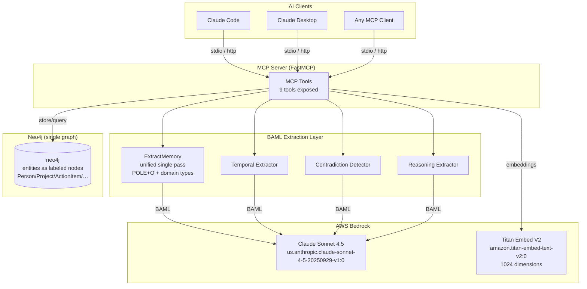
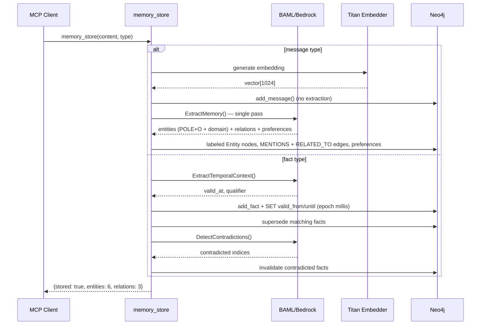
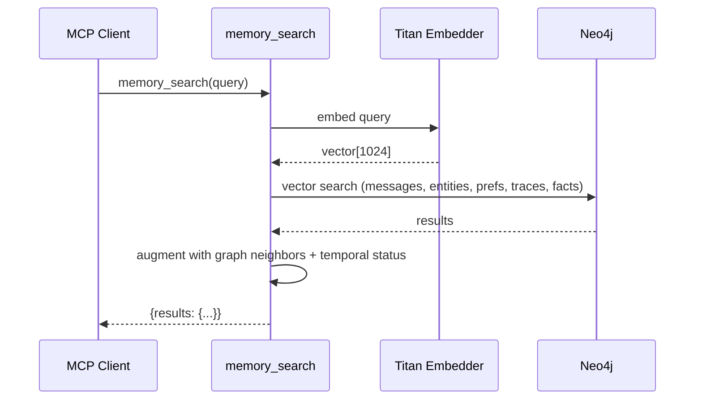
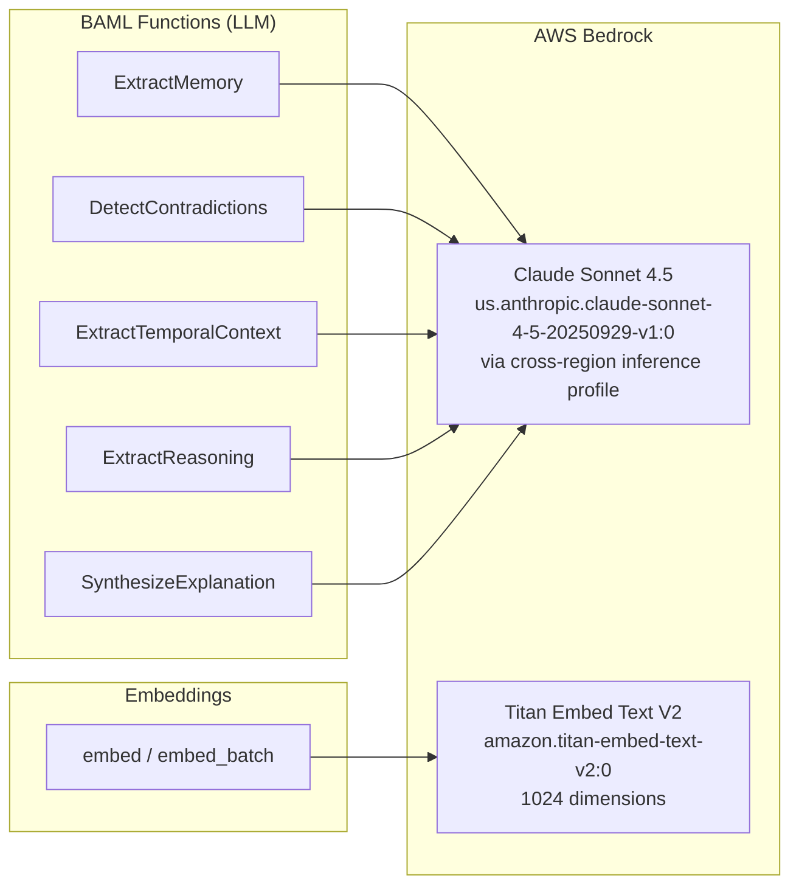
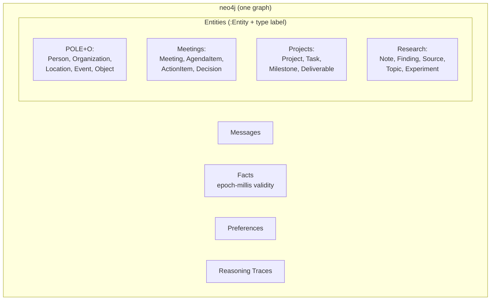
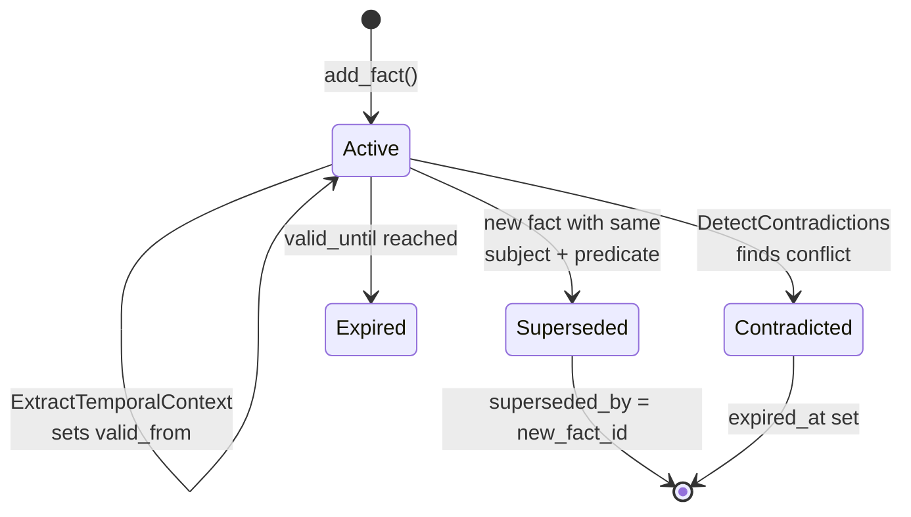
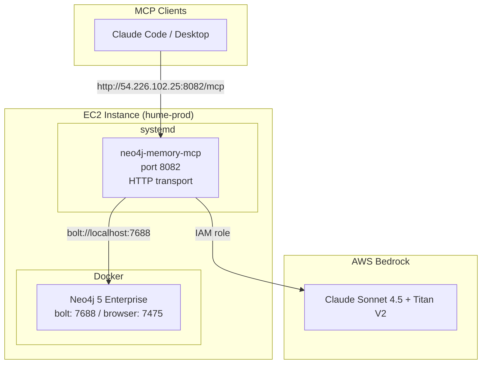

# neo4j-agent-memory-mcp

A production MCP server that gives AI agents persistent graph memory powered by Neo4j and AWS Bedrock. Stores conversations, extracts entities and relationships in a single unified pass, and tracks fact evolution over time in one graph.

## Architecture Overview



## Memory Flow

### Storing a Memory



### Searching Memory



## Features

- **Unified single-pass extraction** -- One BAML call extracts POLE+O + domain entities (meetings/projects/research types), relationships, and preferences, persisted to one graph as labeled nodes
- **AWS Bedrock integration** -- Claude Sonnet 4.5 for extraction, Titan V2 for embeddings. No API keys needed on EC2 (IAM role)
- **BAML extraction pipeline** -- Type-safe structured LLM extraction with automatic retries and fallback chains
- **Temporal fact management** -- Facts track validity periods (epoch-millis), auto-supersede on update, support point-in-time queries, and detect contradictions via LLM
- **Reasoning traces** -- Capture and replay agent reasoning chains with thought/action/observation steps

## Quick Start

### 1. Start Neo4j

```bash
docker compose up -d
```

### 2. Configure Environment

```bash
cp .env.example .env
```

```env
# Neo4j
NEO4J_URI=bolt://localhost:7687
NEO4J_USER=neo4j
NEO4J_PASSWORD=graphmemory

# AWS (local dev uses profile, EC2 uses IAM role)
AWS_PROFILE=graphable-aws
AWS_REGION=us-east-1
NAM_EMBEDDING_PROVIDER=bedrock
NAM_EMBEDDING_MODEL=amazon.titan-embed-text-v2:0
NAM_EMBEDDING_DIMENSIONS=1024
```

### Local mode: Anthropic API key, no Bedrock

If `ANTHROPIC_API_KEY` is set, the server does not use Bedrock at all:
extraction (unified pass, temporal, contradiction, reasoning) routes to the
Anthropic API via a runtime BAML ClientRegistry (`agent_memory_mcp/providers.py`;
model `claude-opus-5`, override with `NAM_ANTHROPIC_MODEL`), embeddings default
to local sentence-transformers (`all-MiniLM-L6-v2`, 384 dims — Anthropic has no
embeddings API), and the startup credential preflight is satisfied by the key
alone. An explicit `NAM_EMBEDDING_PROVIDER` still wins over the key-derived
default.

The whole stack runs on compose — Neo4j plus the server in one command:

```bash
ANTHROPIC_API_KEY=sk-ant-... docker compose up -d   # or put the key in .env
```

The server listens on `127.0.0.1:8080` (HTTP transport, bearer token
`NAM_HTTP_TOKEN`, default `local-dev-token`; clients such as the recall hook
read the same variable). The sentence-transformers model is downloaded on
first search (~12 s) into the `hf-cache` volume; warm searches run in
~400 ms. To run Neo4j alone (host-side server workflow):
`docker compose up -d neo4j`.

Host-side equivalent, without the container:

```bash
uv sync --extra local   # installs sentence-transformers (torch)
ANTHROPIC_API_KEY=sk-ant-... NEO4J_PASSWORD=graphmemory \
  MCP_TRANSPORT=http MCP_PORT=8080 uv run python run_server.py
```

> ⚠️ **Use a fresh graph.** Local embeddings are 384-dimensional; a graph
> whose vector indexes were built by Bedrock Titan (1024) will fail every
> vector query with a dimension mismatch. Wipe the data and drop the
> `*_embedding_idx` vector indexes (they are recreated at 384 on first use),
> or run a separate Neo4j volume for local mode.

### 3. Generate BAML Client

```bash
uv run baml-cli generate
```

### 4. Run the Server

```bash
# stdio (for Claude Desktop / local MCP clients)
uv run neo4j-memory-mcp

# HTTP (for remote / cloud deployment) — a bearer token is REQUIRED whenever
# --host is not a loopback address (127.0.0.1 / localhost / ::1); the server
# refuses to start otherwise. See "Security" below.
NAM_HTTP_TOKEN=$(openssl rand -hex 32) \
  uv run neo4j-memory-mcp --transport http --host 0.0.0.0 --port 8082
```

### 5. Register the Recall Hook (optional)

`memory_search` is a pull tool: the model has to decide to call it. The recall
hook makes retrieval push-mode instead — it runs on every `UserPromptSubmit`,
searches memory with the prompt, and injects compact triples as
`additionalContext` before the model sees the prompt.

Add it to `~/.claude/settings.json` (or a project `.claude/settings.json`):

```json
{
  "hooks": {
    "UserPromptSubmit": [
      {
        "hooks": [
          {
            "type": "command",
            "command": "uv run --project /path/to/neo4j-agent-memory-mcp neo4j-memory-recall-hook"
          }
        ]
      }
    ]
  }
}
```

It needs the server running on HTTP (`docker compose up -d`, or step 4 with
`--transport http`). The hook is fail-open: any error, timeout, or malformed
payload exits 0 with no output, so a down server never blocks a prompt.

| Variable | Default | Purpose |
|----------|---------|---------|
| `NAM_HOOK_URL` | `http://127.0.0.1:8080/mcp` | Server endpoint |
| `NAM_HTTP_TOKEN` | — | Bearer token, if the server requires one |
| `NAM_HOOK_TIMEOUT` | `5` | Whole-call budget, seconds |
| `NAM_HOOK_MAX_CHARS` | `4000` | Cap on injected context size |
| `NAM_HOOK_THRESHOLD` | `0.5` | Similarity cutoff (lower than the server's 0.7) |

### 6. Register the Capture Hook (optional)

The capture hook is the recall hook's write-side counterpart: it runs on
`SessionEnd`, renders the session transcript, and calls
`capture_session_memory` — the server extracts decisions, gotchas, and dead
ends from the transcript and anchors them to the files and task the session
touched. Without it, the extracted memory plane never gets written.

Add it to `~/.claude/settings.json` (or a project `.claude/settings.json`):

```json
{
  "hooks": {
    "SessionEnd": [
      {
        "hooks": [
          {
            "type": "command",
            "command": "uv run --project /path/to/neo4j-agent-memory-mcp neo4j-memory-capture-hook"
          }
        ]
      }
    ]
  }
}
```

Like the recall hook it needs the server running on HTTP and is fail-open:
any error, timeout, or malformed payload exits 0. It prints nothing on
success — `SessionEnd` output is not injected anywhere. The rendering
includes tool activity (edit/bash markers and tool output, errors nearly
whole) and is capped at 400,000 characters; the server cuts it into
60,000-character windows and extracts from the newest plus the windows
with the most failure and correction evidence (`NAM_CAPTURE_MAX_WINDOWS`,
default 4). Lessons anchor to files from the transcript's edits, the last
24 hours of commits, and the working tree. One `CurateCodingMemory` call
per window screens the candidates against the nearest lessons already
stored (`NAM_CAPTURE_JUDGE=off` skips it).

| Variable | Default | Purpose |
|----------|---------|---------|
| `NAM_CAPTURE_DISABLED` | — | Set to `1` to disable the hook (kill switch) |
| `NAM_HOOK_URL` | `http://127.0.0.1:8080/mcp` | Server endpoint |
| `NAM_HTTP_TOKEN` | — | Bearer token, if the server requires one |
| `NAM_CAPTURE_TIMEOUT` | `30` | Whole-call budget, seconds (extraction is an LLM call) |
| `NAM_AGENT_ID` | payload session id | Stable agent identity |
| `NAM_TASK_KEY` | inferred from branch | Explicit task key override |

## MCP Tools

| Tool | Purpose |
|------|---------|
| `memory_search` | Hybrid vector + graph search across all memory types, augmented with graph neighbors and temporal status. |
| `memory_store` | Store messages, facts (SPO triples), or preferences. Messages run a unified extraction pass; facts run temporal extraction + contradiction detection. |
| `entity_lookup` | Look up entity by name with graph traversal. `entity_type` is validated against a safe label allowlist. |
| `conversation_history` | Retrieve chronological message history for a session. |
| `graph_query` | Execute read-only Cypher queries (enforced via a READ-access-mode transaction). |
| `add_reasoning_trace` | Store structured reasoning traces with thought/action/observation steps. |
| `explain_reasoning` | Retrieve and explain past reasoning chains. Supports semantic search. |
| `extract_reasoning` | Extract structured reasoning from conversation text via LLM. |
| `temporal_query` | Point-in-time fact queries -- "what was true on date X?" |

## Security

### HTTP/SSE transport authentication

The `http`/`sse` transports are gated by a static bearer token. Set
`NAM_HTTP_TOKEN` (or pass `--http-token`) and clients must send
`Authorization: Bearer <token>` on every request; requests without it, or with
the wrong token, get `401 Unauthorized` before reaching any tool.

**The server refuses to start** if `--host`/`MCP_HOST` is anything other than
a loopback address (`127.0.0.1`, `localhost`, `::1`) and no token is
configured — this closes the gap where the server previously documented
binding `0.0.0.0` with no authentication at all. Loopback binds (e.g. behind
an authenticating reverse proxy or an SSH tunnel) are still allowed without a
token.

```bash
export NAM_HTTP_TOKEN=$(openssl rand -hex 32)
uv run neo4j-memory-mcp --transport http --host 0.0.0.0 --port 8082
```

Clients then connect with `http://<host>:<port>/mcp` and an
`Authorization: Bearer $NAM_HTTP_TOKEN` header.

### Read-only account for `graph_query` (RBAC)

`graph_query` already runs every query in a genuine Neo4j READ-access-mode
transaction (`_execute_read_only` in `mcp/_tools.py`), so the server itself
rejects write clauses and write-mode procedures (e.g. `apoc.cypher.doIt`)
regardless of which account is used. As defense-in-depth on top of that, the
`graph_query` path can additionally authenticate as a **dedicated read-only
Neo4j account** instead of the primary read-write credentials the rest of the
server uses.

Configure it via:

```env
NAM_NEO4J_READONLY_USERNAME=nam_readonly
NAM_NEO4J_READONLY_PASSWORD=<a strong, dedicated password>
```

When both are set, `graph_query` connects with those credentials; when unset
(the default), it falls back to the primary connection — no behavior change.

This requires **Neo4j Enterprise** (custom RBAC roles aren't available on
Community). Provision the account with `cypher-shell` or the Neo4j Browser,
connected as an admin:

```cypher
// Create a role restricted to read-only Cypher on the target database
CREATE ROLE nam_readonly_role IF NOT EXISTS;
GRANT ACCESS ON DATABASE neo4j TO nam_readonly_role;
GRANT MATCH {*} ON GRAPH neo4j TO nam_readonly_role;
GRANT TRAVERSE ON GRAPH neo4j TO nam_readonly_role;
DENY WRITE ON GRAPH neo4j TO nam_readonly_role;

// Create the user and assign the role (drop the default admin roles)
CREATE USER nam_readonly IF NOT EXISTS
  SET PASSWORD '<a strong, dedicated password>' CHANGE NOT REQUIRED;
GRANT ROLE nam_readonly_role TO nam_readonly;
```

Verify the account is actually write-blocked before wiring it in:

```cypher
:param user => 'nam_readonly';
:param password => '<a strong, dedicated password>';
// connect as nam_readonly, then:
CREATE (n:ProvisioningTest) RETURN n;
// expected: "PermissionDenied" / "Write operations are not allowed"
```

## AWS Bedrock Integration



### Authentication

| Environment | Method | Config |
|------------|--------|--------|
| Local dev | AWS named profile | `AWS_PROFILE=graphable-aws` |
| EC2 production | IAM instance role | Just set `AWS_REGION=us-east-1` |

### Required IAM Permissions

```json
{
  "Statement": [
    {
      "Effect": "Allow",
      "Action": ["bedrock:InvokeModel", "bedrock:InvokeModelWithResponseStream"],
      "Resource": [
        "arn:aws:bedrock:*:<account>:inference-profile/us.anthropic.*",
        "arn:aws:bedrock:*::foundation-model/anthropic.*",
        "arn:aws:bedrock:us-east-1::foundation-model/amazon.titan-embed-text-v2:0"
      ]
    },
    {
      "Effect": "Allow",
      "Action": ["aws-marketplace:ViewSubscriptions", "aws-marketplace:Subscribe"],
      "Resource": "*"
    }
  ]
}
```

> The `us.` inference profile prefix routes across `us-east-1`, `us-east-2`, and `us-west-2`, so IAM must use wildcard region.

## Unified Ontology (single graph)

All memory lives in one Neo4j graph. Entities are `:Entity` nodes with an
additional **type label** (PascalCase) drawn from a consolidated ontology — the
generic POLE+O core plus domain-specific work types. Relationships use a single
`RELATED_TO` edge with the semantic type in the `relation_type` property.



| Domain | Entity Types (labels) | Key Relationships (`relation_type`) |
|--------|-----------------------|-------------------------------------|
| core (POLE+O) | Person, Organization, Location, Event, Object | WORKS_AT, MEMBER_OF, LIVES_IN, LOCATED_IN, OWNS, KNOWS, PART_OF |
| meetings | Meeting, AgendaItem, ActionItem, Decision | ATTENDED, PRESENTED, DISCUSSED, DECIDED_IN, ASSIGNED_TO, FOLLOW_UP, RESULTED_IN |
| projects | Project, Task, Milestone, Deliverable | DEPENDS_ON, BLOCKED_BY, DELIVERS, CONTRIBUTES_TO, TRACKS |
| research | Note, Finding, Source, Topic, Experiment | CITES, SUPPORTS, CONTRADICTS, BUILDS_ON, EXPLORES, PRODUCED_BY, VALIDATES |

Cross-domain links (e.g. a `Meeting` is `ABOUT` a `Project`) are captured in the
same pass. A person who attends a meeting is a single `Person` node linked via
`ATTENDED` — there is no separate attendee type, and teams are `Organization`.

## Temporal Fact Management



Facts support:
- **Auto-supersession**: Storing `Alice WORKS_AT Globex` automatically supersedes `Alice WORKS_AT Acme`
- **LLM contradiction detection**: Finds semantic conflicts beyond exact subject+predicate matches
- **Temporal extraction**: Auto-detects "since March", "as of yesterday" from natural language
- **Point-in-time queries**: `temporal_query` tool retrieves what was true at any given datetime
- **Fact evolution**: `fact_evolution` tool shows the full version history of a subject+predicate

## BAML Extraction Pipeline

5 BAML functions defined in `baml_src/`:

| Function | File | Purpose |
|----------|------|---------|
| `ExtractMemory` | `extraction.baml` | Unified single pass: POLE+O + domain entities, relations, and preferences |
| `DetectContradictions` | `temporal.baml` | Find contradictions between new and existing facts |
| `ExtractTemporalContext` | `temporal.baml` | Extract temporal markers from text |
| `ExtractReasoning` | `reasoning.baml` | Extract reasoning chains from conversations |
| `SynthesizeExplanation` | `reasoning.baml` | Generate natural language from reasoning chains |

### Provider Configuration

Defined in `baml_src/clients.baml`:

| Client | Provider | Model |
|--------|----------|-------|
| `Bedrock` | aws-bedrock | Claude Sonnet 4.5 (default) |
| `OpenAI` | openai | gpt-4o-mini |
| `Gemini` | google-ai | Gemini 2.5 Flash |
| `Resilient` | fallback | Bedrock -> OpenAI -> Gemini |

> The Bedrock pin is the Sonnet 4.5 cross-region inference profile
> (`us.anthropic.claude-sonnet-4-5-20250929-v1:0`). To move to Sonnet 5, confirm
> the Bedrock inference-profile ID and that model access is enabled in your AWS
> account, then update `baml_src/clients.baml`.

## Deployment

### Production Architecture



### Deploy Commands

```bash
# Full deploy (first time)
./deploy/deploy.sh

# Update (pull + restart)
./deploy/deploy.sh update
```

The deploy script:
1. Pulls latest code via git
2. Runs `uv sync --frozen --no-dev` (installs `agent_memory_mcp` like any
   normal package — no site-packages copying)
3. Regenerates BAML client
4. Restarts the systemd service

### Production Environment

```env
# deploy/.env
NEO4J_URI=bolt://localhost:7688
NEO4J_PASSWORD=graphmemory
AWS_REGION=us-east-1
NAM_EMBEDDING_PROVIDER=bedrock
MCP_TRANSPORT=sse
MCP_HOST=0.0.0.0
MCP_PORT=8082
NAM_HTTP_TOKEN=<strong random token — required, MCP_HOST is non-loopback>
NEO4J_DOCKER_AUTO=false
# Defense-in-depth for graph_query — see "Security" above (optional, Enterprise only)
NAM_NEO4J_READONLY_USERNAME=nam_readonly
NAM_NEO4J_READONLY_PASSWORD=<a strong, dedicated password>
```

## Configuration Reference

| Variable | Default | Description |
|----------|---------|-------------|
| `NEO4J_URI` | `bolt://localhost:7687` | Neo4j connection URI |
| `NEO4J_USER` | `neo4j` | Neo4j username |
| `NEO4J_PASSWORD` | -- | Neo4j password |
| `NEO4J_DATABASE` | `neo4j` | Database name (single graph) |
| `AWS_PROFILE` | -- | AWS credentials profile (local dev) |
| `AWS_REGION` | `us-east-1` | AWS region for Bedrock |
| `NAM_EMBEDDING_PROVIDER` | `bedrock` | Embedding provider: bedrock, openai |
| `NAM_EMBEDDING_MODEL` | `amazon.titan-embed-text-v2:0` | Embedding model |
| `NAM_EMBEDDING_DIMENSIONS` | `1024` | Vector dimensions |
| `NAM_TEMPORAL_EXTRACTION` | `true` | Auto-extract temporal context from facts |
| `NAM_CONTRADICTION_DETECTION` | `true` | Enable LLM contradiction detection |
| `MCP_TRANSPORT` | `stdio` | Transport: stdio, sse, http |
| `MCP_HOST` | `127.0.0.1` | Bind host for network transports |
| `MCP_PORT` | `8080` | Bind port for network transports |
| `NAM_HTTP_TOKEN` | -- | Bearer token for HTTP/SSE transport. **Required** whenever `MCP_HOST` is non-loopback — the server refuses to bind otherwise. |
| `NAM_NEO4J_READONLY_USERNAME` | -- | Dedicated read-only Neo4j account username for `graph_query` (optional, Enterprise RBAC — see "Security") |
| `NAM_NEO4J_READONLY_PASSWORD` | -- | Dedicated read-only Neo4j account password (both must be set to take effect) |
| `NEO4J_DOCKER_AUTO` | `true` | Auto-manage Neo4j Docker container |
| `LOG_LEVEL` | `INFO` | Log level |
| `LOG_FORMAT` | `text` | Log format: text, json |

## Development

### Running Tests

```bash
# Unit tests
uv run pytest tests/ -v --ignore=tests/integration

# Integration tests (requires Neo4j + AWS credentials)
uv run pytest tests/integration/ -v -m integration
```

### Regenerating BAML Client

After modifying any `.baml` file:

```bash
uv run baml-cli generate
```

### Project Structure

```
baml_src/
  clients.baml              # LLM provider config (Bedrock, OpenAI, Gemini)
  extraction.baml           # Unified ExtractMemory (POLE+O + domain ontology)
  temporal.baml             # Contradiction detection + temporal extraction
  reasoning.baml            # Reasoning chain extraction + synthesis

src/agent_memory_mcp/       # Own namespace — does NOT shadow upstream
  mcp/                      #   neo4j_agent_memory (pinned dependency)
    server.py               # Server creation, lifespan, transports
    _bootstrap.py           # Fail-loud upstream patch bootstrap (all paths)
    _embedder_patch.py      # Bedrock embedder factory patch
    _extractor_patch.py     # BAML extractor factory patch (library callers)
    _tools.py               # 9 MCP tool implementations
    _database_init.py       # Index creation (single graph)
    _docker.py              # Docker compose management
  extraction/
    unified.py              # Unified single-pass extraction + persistence
    reasoning_extractor.py  # Reasoning chain extraction
  temporal/
    contradiction.py        # LLM contradiction detection pipeline
    extraction.py           # Temporal context extraction
    lifecycle.py            # Fact supersession + point-in-time queries
  baml_client/              # Auto-generated BAML Python client

deploy/
  deploy.sh                 # SSH-based deploy to EC2
  docker-compose.prod.yml   # Neo4j 5 Enterprise production config
  neo4j-memory-mcp.service  # systemd service unit
  .env.prod.example         # Production env template
```
