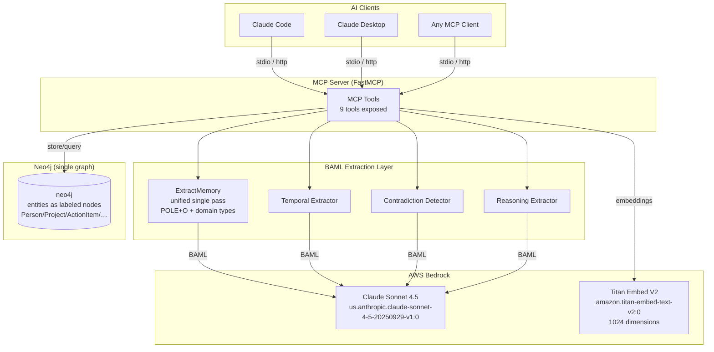
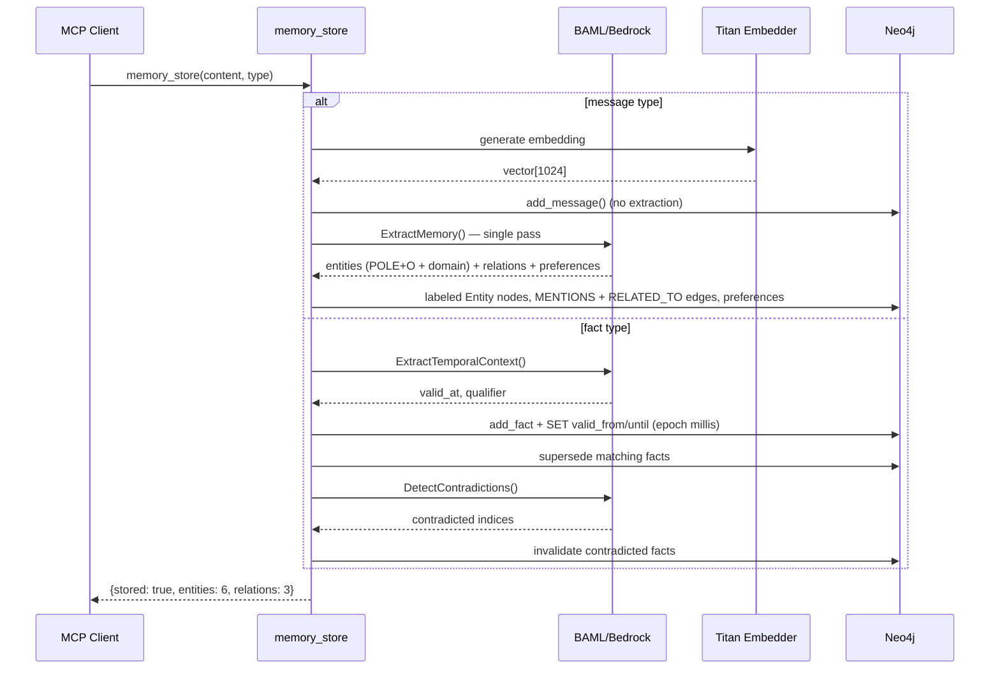
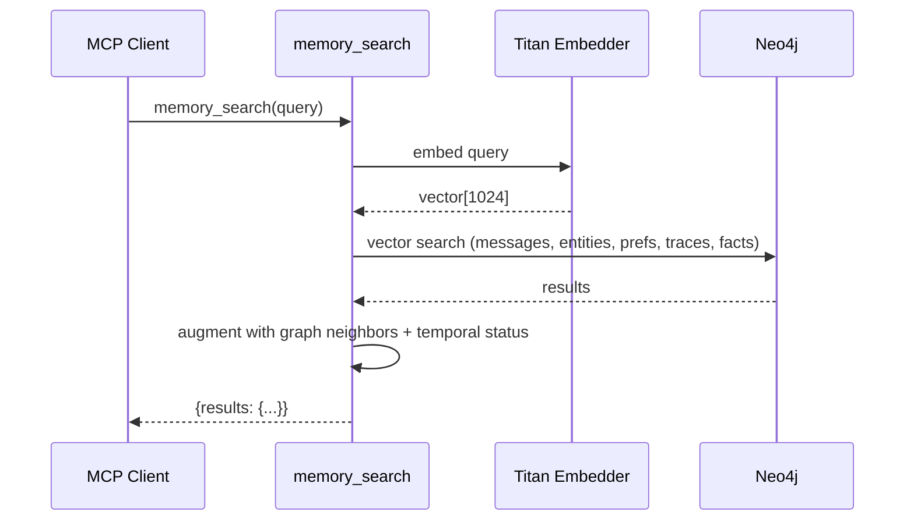
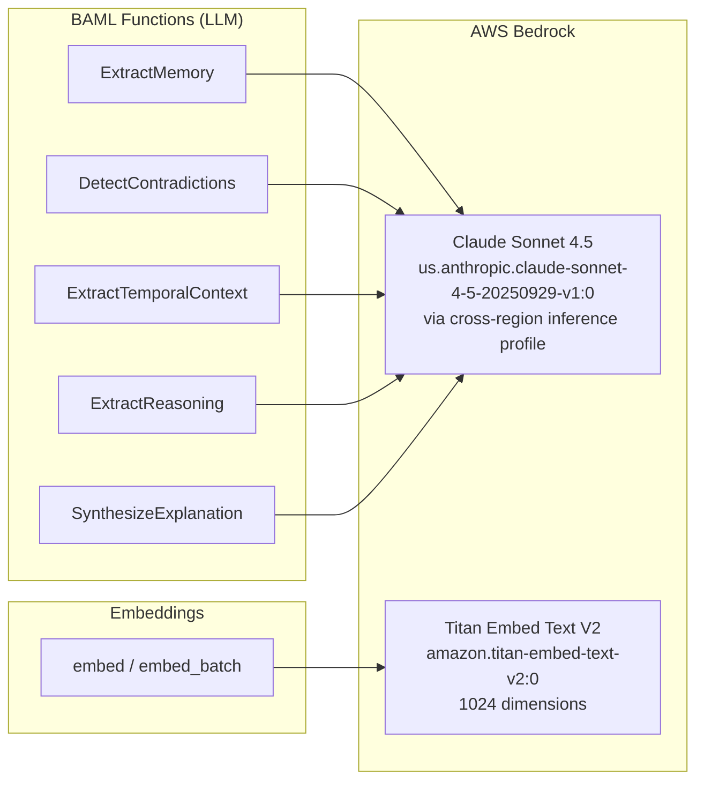
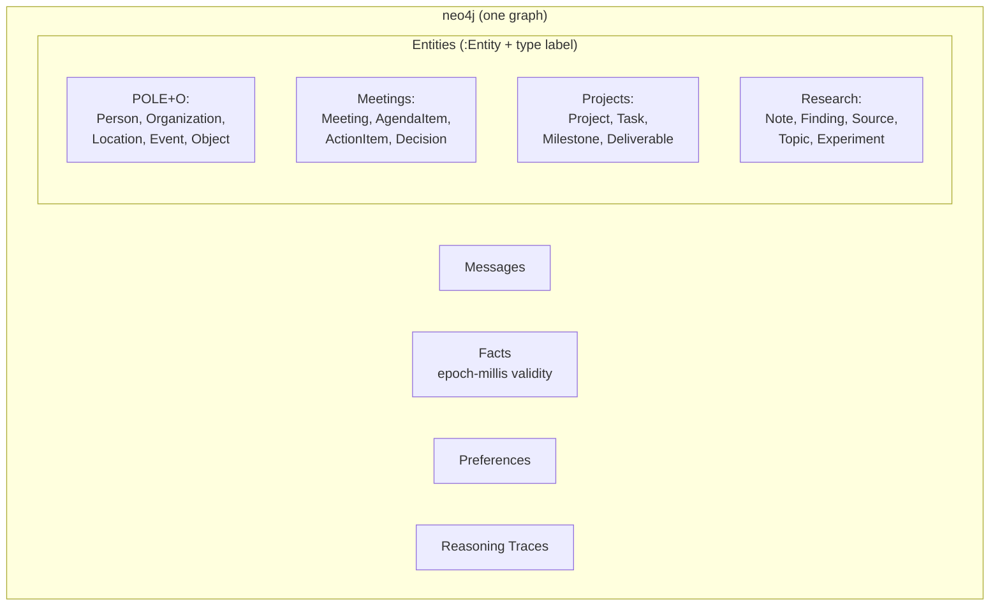
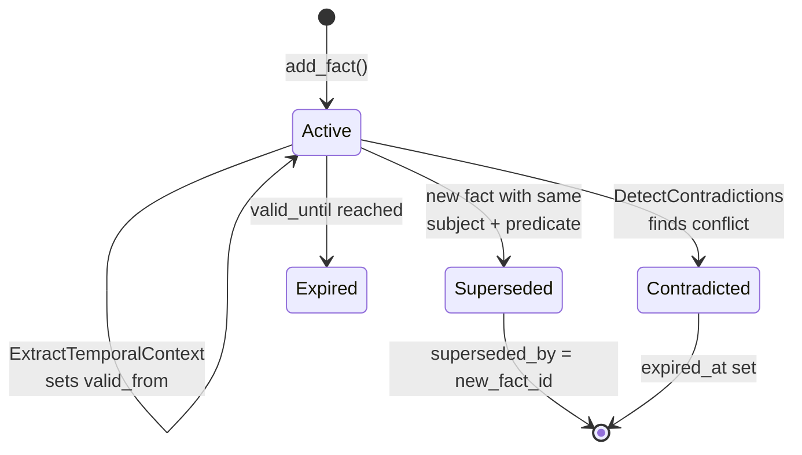
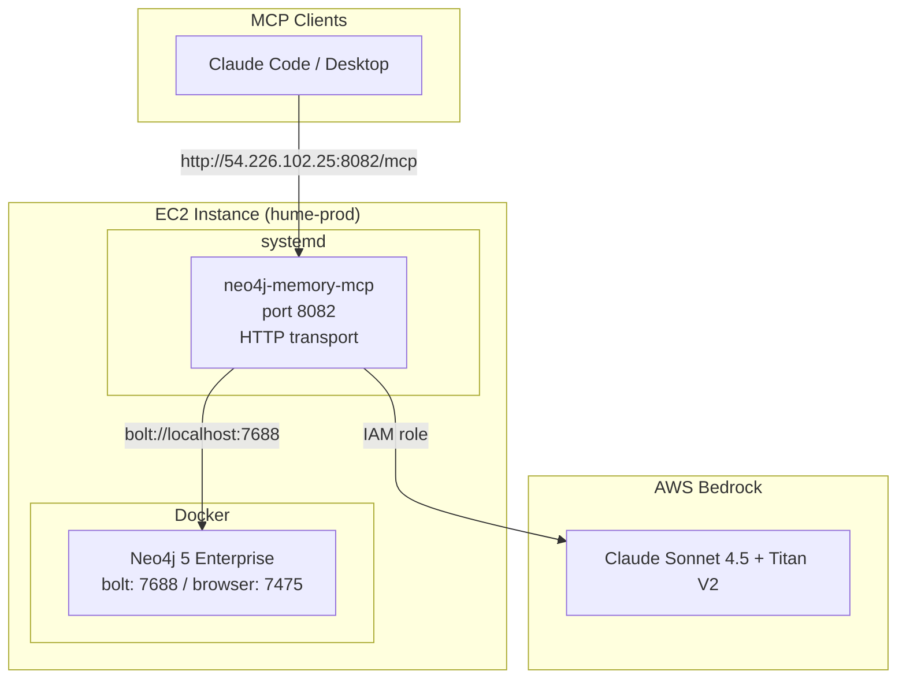

# neo4j-agent-memory-mcp

A production MCP server that gives AI agents persistent graph memory powered by Neo4j and AWS Bedrock. Stores conversations, extracts entities and relationships in a single unified pass, and tracks fact evolution over time in one graph.

## Architecture Overview



## Memory Flow

### Storing a Memory



### Searching Memory



## Features

- **Unified single-pass extraction** -- One BAML call extracts POLE+O + domain entities (meetings/projects/research types), relationships, and preferences, persisted to one graph as labeled nodes
- **AWS Bedrock integration** -- Claude Sonnet 4.5 for extraction, Titan V2 for embeddings. No API keys needed on EC2 (IAM role)
- **BAML extraction pipeline** -- Type-safe structured LLM extraction with automatic retries and fallback chains
- **Temporal fact management** -- Facts track validity periods (epoch-millis), auto-supersede on update, support point-in-time queries, and detect contradictions via LLM
- **Reasoning traces** -- Capture and replay agent reasoning chains with thought/action/observation steps

## Quick Start

### 1. Start Neo4j

```bash
docker compose up -d
```

### 2. Configure Environment

```bash
cp .env.example .env
```

```env
# Neo4j
NEO4J_URI=bolt://localhost:7687
NEO4J_USER=neo4j
NEO4J_PASSWORD=graphmemory

# AWS (local dev uses profile, EC2 uses IAM role)
AWS_PROFILE=graphable-aws
AWS_REGION=us-east-1
NAM_EMBEDDING_PROVIDER=bedrock
NAM_EMBEDDING_MODEL=amazon.titan-embed-text-v2:0
NAM_EMBEDDING_DIMENSIONS=1024
```

### 3. Generate BAML Client

```bash
uv run baml-cli generate
```

### 4. Run the Server

```bash
# stdio (for Claude Desktop / local MCP clients)
uv run neo4j-memory-mcp

# HTTP (for remote / cloud deployment)
uv run neo4j-memory-mcp --transport http --host 0.0.0.0 --port 8082
```

## MCP Tools

| Tool | Purpose |
|------|---------|
| `memory_search` | Hybrid vector + graph search across all memory types, augmented with graph neighbors and temporal status. |
| `memory_store` | Store messages, facts (SPO triples), or preferences. Messages run a unified extraction pass; facts run temporal extraction + contradiction detection. |
| `entity_lookup` | Look up entity by name with graph traversal. `entity_type` is validated against a safe label allowlist. |
| `conversation_history` | Retrieve chronological message history for a session. |
| `graph_query` | Execute read-only Cypher queries (enforced via a READ-access-mode transaction). |
| `add_reasoning_trace` | Store structured reasoning traces with thought/action/observation steps. |
| `explain_reasoning` | Retrieve and explain past reasoning chains. Supports semantic search. |
| `extract_reasoning` | Extract structured reasoning from conversation text via LLM. |
| `temporal_query` | Point-in-time fact queries -- "what was true on date X?" |

## AWS Bedrock Integration



### Authentication

| Environment | Method | Config |
|------------|--------|--------|
| Local dev | AWS named profile | `AWS_PROFILE=graphable-aws` |
| EC2 production | IAM instance role | Just set `AWS_REGION=us-east-1` |

### Required IAM Permissions

```json
{
  "Statement": [
    {
      "Effect": "Allow",
      "Action": ["bedrock:InvokeModel", "bedrock:InvokeModelWithResponseStream"],
      "Resource": [
        "arn:aws:bedrock:*:<account>:inference-profile/us.anthropic.*",
        "arn:aws:bedrock:*::foundation-model/anthropic.*",
        "arn:aws:bedrock:us-east-1::foundation-model/amazon.titan-embed-text-v2:0"
      ]
    },
    {
      "Effect": "Allow",
      "Action": ["aws-marketplace:ViewSubscriptions", "aws-marketplace:Subscribe"],
      "Resource": "*"
    }
  ]
}
```

> The `us.` inference profile prefix routes across `us-east-1`, `us-east-2`, and `us-west-2`, so IAM must use wildcard region.

## Unified Ontology (single graph)

All memory lives in one Neo4j graph. Entities are `:Entity` nodes with an
additional **type label** (PascalCase) drawn from a consolidated ontology — the
generic POLE+O core plus domain-specific work types. Relationships use a single
`RELATED_TO` edge with the semantic type in the `relation_type` property.



| Domain | Entity Types (labels) | Key Relationships (`relation_type`) |
|--------|-----------------------|-------------------------------------|
| core (POLE+O) | Person, Organization, Location, Event, Object | WORKS_AT, MEMBER_OF, LIVES_IN, LOCATED_IN, OWNS, KNOWS, PART_OF |
| meetings | Meeting, AgendaItem, ActionItem, Decision | ATTENDED, PRESENTED, DISCUSSED, DECIDED_IN, ASSIGNED_TO, FOLLOW_UP, RESULTED_IN |
| projects | Project, Task, Milestone, Deliverable | DEPENDS_ON, BLOCKED_BY, DELIVERS, CONTRIBUTES_TO, TRACKS |
| research | Note, Finding, Source, Topic, Experiment | CITES, SUPPORTS, CONTRADICTS, BUILDS_ON, EXPLORES, PRODUCED_BY, VALIDATES |

Cross-domain links (e.g. a `Meeting` is `ABOUT` a `Project`) are captured in the
same pass. A person who attends a meeting is a single `Person` node linked via
`ATTENDED` — there is no separate attendee type, and teams are `Organization`.

## Temporal Fact Management



Facts support:
- **Auto-supersession**: Storing `Alice WORKS_AT Globex` automatically supersedes `Alice WORKS_AT Acme`
- **LLM contradiction detection**: Finds semantic conflicts beyond exact subject+predicate matches
- **Temporal extraction**: Auto-detects "since March", "as of yesterday" from natural language
- **Point-in-time queries**: `temporal_query` tool retrieves what was true at any given datetime
- **Fact evolution**: `fact_evolution` tool shows the full version history of a subject+predicate

## BAML Extraction Pipeline

5 BAML functions defined in `baml_src/`:

| Function | File | Purpose |
|----------|------|---------|
| `ExtractMemory` | `extraction.baml` | Unified single pass: POLE+O + domain entities, relations, and preferences |
| `DetectContradictions` | `temporal.baml` | Find contradictions between new and existing facts |
| `ExtractTemporalContext` | `temporal.baml` | Extract temporal markers from text |
| `ExtractReasoning` | `reasoning.baml` | Extract reasoning chains from conversations |
| `SynthesizeExplanation` | `reasoning.baml` | Generate natural language from reasoning chains |

### Provider Configuration

Defined in `baml_src/clients.baml`:

| Client | Provider | Model |
|--------|----------|-------|
| `Bedrock` | aws-bedrock | Claude Sonnet 4.5 (default) |
| `OpenAI` | openai | gpt-4o-mini |
| `Gemini` | google-ai | Gemini 2.5 Flash |
| `Resilient` | fallback | Bedrock -> OpenAI -> Gemini |

> The Bedrock pin is the Sonnet 4.5 cross-region inference profile
> (`us.anthropic.claude-sonnet-4-5-20250929-v1:0`). To move to Sonnet 5, confirm
> the Bedrock inference-profile ID and that model access is enabled in your AWS
> account, then update `baml_src/clients.baml`.

## Deployment

### Production Architecture



### Deploy Commands

```bash
# Full deploy (first time)
./deploy/deploy.sh

# Update (pull + restart)
./deploy/deploy.sh update
```

The deploy script:
1. Pulls latest code via git
2. Runs `uv sync --frozen --no-dev`
3. Regenerates BAML client
4. Syncs overlay files to site-packages
5. Restarts the systemd service

### Production Environment

```env
# deploy/.env
NEO4J_URI=bolt://localhost:7688
NEO4J_PASSWORD=graphmemory
AWS_REGION=us-east-1
NAM_EMBEDDING_PROVIDER=bedrock
MCP_TRANSPORT=sse
MCP_HOST=0.0.0.0
MCP_PORT=8082
NEO4J_DOCKER_AUTO=false
```

## Configuration Reference

| Variable | Default | Description |
|----------|---------|-------------|
| `NEO4J_URI` | `bolt://localhost:7687` | Neo4j connection URI |
| `NEO4J_USER` | `neo4j` | Neo4j username |
| `NEO4J_PASSWORD` | -- | Neo4j password |
| `NEO4J_DATABASE` | `neo4j` | Database name (single graph) |
| `AWS_PROFILE` | -- | AWS credentials profile (local dev) |
| `AWS_REGION` | `us-east-1` | AWS region for Bedrock |
| `NAM_EMBEDDING_PROVIDER` | `bedrock` | Embedding provider: bedrock, openai |
| `NAM_EMBEDDING_MODEL` | `amazon.titan-embed-text-v2:0` | Embedding model |
| `NAM_EMBEDDING_DIMENSIONS` | `1024` | Vector dimensions |
| `NAM_TEMPORAL_EXTRACTION` | `true` | Auto-extract temporal context from facts |
| `NAM_CONTRADICTION_DETECTION` | `true` | Enable LLM contradiction detection |
| `MCP_TRANSPORT` | `stdio` | Transport: stdio, sse, http |
| `MCP_HOST` | `127.0.0.1` | Bind host for network transports |
| `MCP_PORT` | `8080` | Bind port for network transports |
| `NEO4J_DOCKER_AUTO` | `true` | Auto-manage Neo4j Docker container |
| `LOG_LEVEL` | `INFO` | Log level |
| `LOG_FORMAT` | `text` | Log format: text, json |

## Development

### Running Tests

```bash
# Unit tests
uv run pytest tests/ -v --ignore=tests/integration

# Integration tests (requires Neo4j + AWS credentials)
uv run pytest tests/integration/ -v -m integration
```

### Regenerating BAML Client

After modifying any `.baml` file:

```bash
uv run baml-cli generate
```

### Project Structure

```
baml_src/
  clients.baml              # LLM provider config (Bedrock, OpenAI, Gemini)
  extraction.baml           # Unified ExtractMemory (POLE+O + domain ontology)
  temporal.baml             # Contradiction detection + temporal extraction
  reasoning.baml            # Reasoning chain extraction + synthesis

src/neo4j_agent_memory/
  mcp/
    server.py               # Server creation, lifespan, Bedrock embedder patch
    _tools.py               # 9 MCP tool implementations
    _database_init.py       # Index creation (single graph)
    _docker.py              # Docker compose management
    _embedder_patch.py      # Bedrock embedder factory patch
  extraction/
    unified.py              # Unified single-pass extraction + persistence
    reasoning_extractor.py  # Reasoning chain extraction
  temporal/
    contradiction.py        # LLM contradiction detection pipeline
    extraction.py           # Temporal context extraction
    lifecycle.py            # Fact supersession + point-in-time queries
  baml_client/              # Auto-generated BAML Python client

deploy/
  deploy.sh                 # SSH-based deploy to EC2
  docker-compose.prod.yml   # Neo4j 5 Enterprise production config
  neo4j-memory-mcp.service  # systemd service unit
  .env.prod.example         # Production env template
```
