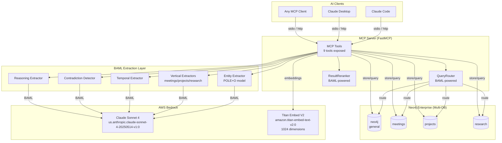
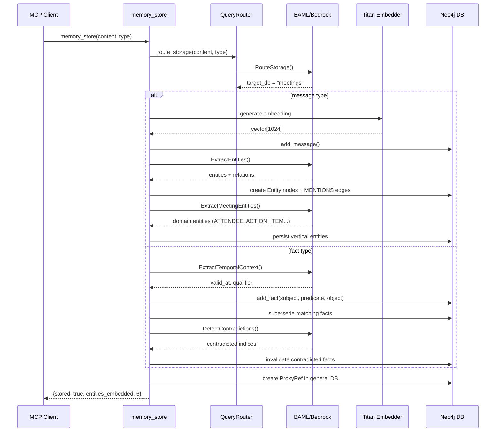
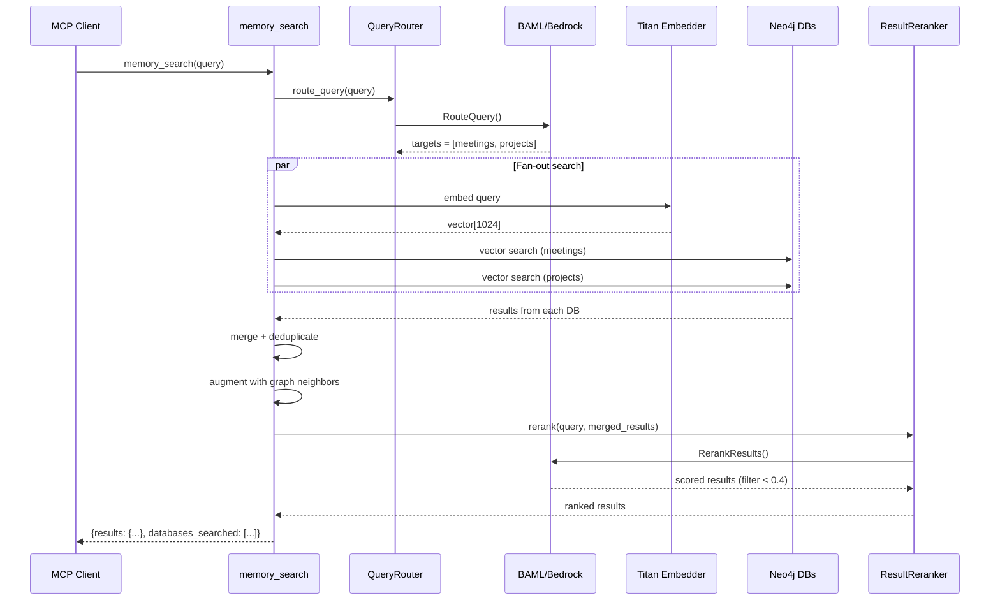
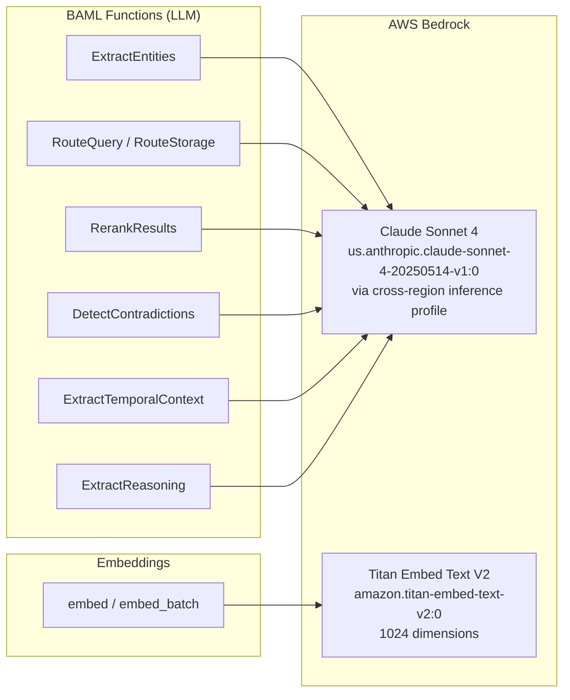
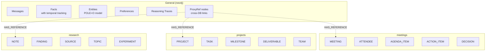
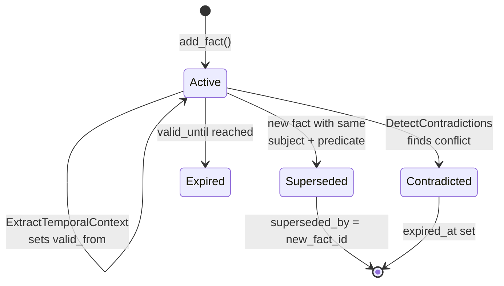
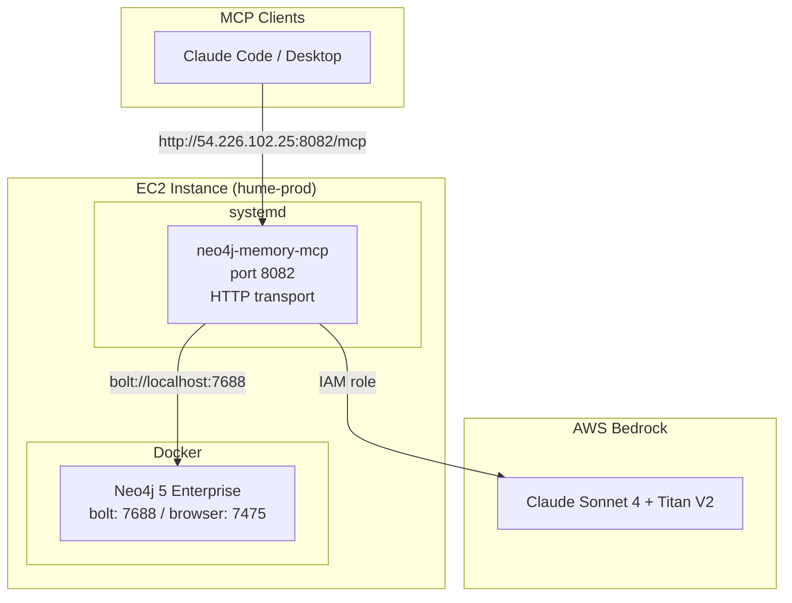

# neo4j-agent-memory-mcp

A production MCP server that gives AI agents persistent graph memory powered by Neo4j and AWS Bedrock. Stores conversations, extracts entities and relationships, tracks fact evolution over time, and routes queries across domain-specific databases.

## Architecture Overview



## Memory Flow

### Storing a Memory



### Searching Memory



## Features

- **Multi-database verticals** -- Separate Neo4j databases for meetings, projects, and research with domain-specific ontologies
- **AWS Bedrock integration** -- Claude Sonnet 4 for extraction/routing, Titan V2 for embeddings. No API keys needed on EC2 (IAM role)
- **BAML extraction pipeline** -- Type-safe structured LLM extraction with automatic retries and fallback chains
- **Temporal fact management** -- Facts track validity periods, auto-supersede on update, and detect contradictions via LLM
- **Intelligent routing** -- LLM-powered query/storage routing with caching, stampede prevention, and disambiguation
- **Reasoning traces** -- Capture and replay agent reasoning chains with thought/action/observation steps
- **Cross-database search** -- Parallel fan-out queries with result merging, deduplication, and re-ranking

## Quick Start

### 1. Start Neo4j

```bash
docker compose up -d
```

### 2. Configure Environment

```bash
cp .env.example .env
```

```env
# Neo4j
NEO4J_URI=bolt://localhost:7687
NEO4J_USER=neo4j
NEO4J_PASSWORD=graphmemory

# Entity extraction via Bedrock
NAM_EXTRACTION__BAML_ENABLED=true
NAM_EXTRACTION__BAML_CLIENT=Bedrock

# AWS (local dev uses profile, EC2 uses IAM role)
AWS_PROFILE=graphable-aws
AWS_REGION=us-east-1
NAM_EMBEDDING_PROVIDER=bedrock
NAM_EMBEDDING_MODEL=amazon.titan-embed-text-v2:0
NAM_EMBEDDING_DIMENSIONS=1024

# Verticals & routing
NAM_VERTICALS=meetings,projects,research
NAM_ROUTING_ENABLED=true
```

### 3. Generate BAML Client

```bash
uv run baml-cli generate
```

### 4. Run the Server

```bash
# stdio (for Claude Desktop / local MCP clients)
uv run neo4j-memory-mcp

# HTTP (for remote / cloud deployment)
uv run neo4j-memory-mcp --transport http --host 0.0.0.0 --port 8082
```

## MCP Tools

| Tool | Purpose |
|------|---------|
| `memory_search` | Hybrid vector + graph search across all memory types. Auto-routes to verticals, supports fan-out + re-ranking. |
| `memory_store` | Store messages, facts (SPO triples), or preferences. Runs entity extraction, temporal extraction, contradiction detection. |
| `entity_lookup` | Look up entity by name with graph traversal. Resolves cross-database proxy references. |
| `conversation_history` | Retrieve chronological message history for a session. |
| `graph_query` | Execute read-only Cypher queries against any database. |
| `add_reasoning_trace` | Store structured reasoning traces with thought/action/observation steps. |
| `explain_reasoning` | Retrieve and explain past reasoning chains. Supports semantic search. |
| `extract_reasoning` | Extract structured reasoning from conversation text via LLM. |
| `temporal_query` | Point-in-time fact queries -- "what was true on date X?" |

All tools accept an optional `database` parameter to target a specific vertical. Without it, the router decides.

## AWS Bedrock Integration



### Authentication

| Environment | Method | Config |
|------------|--------|--------|
| Local dev | AWS named profile | `AWS_PROFILE=graphable-aws` |
| EC2 production | IAM instance role | Just set `AWS_REGION=us-east-1` |

### Required IAM Permissions

```json
{
  "Statement": [
    {
      "Effect": "Allow",
      "Action": ["bedrock:InvokeModel", "bedrock:InvokeModelWithResponseStream"],
      "Resource": [
        "arn:aws:bedrock:*:<account>:inference-profile/us.anthropic.*",
        "arn:aws:bedrock:*::foundation-model/anthropic.*",
        "arn:aws:bedrock:us-east-1::foundation-model/amazon.titan-embed-text-v2:0"
      ]
    },
    {
      "Effect": "Allow",
      "Action": ["aws-marketplace:ViewSubscriptions", "aws-marketplace:Subscribe"],
      "Resource": "*"
    }
  ]
}
```

> The `us.` inference profile prefix routes across `us-east-1`, `us-east-2`, and `us-west-2`, so IAM must use wildcard region.

## Multi-Database Verticals



Each vertical has domain-specific entity types and relationships:

| Vertical | Entity Types | Key Relationships |
|----------|-------------|-------------------|
| meetings | MEETING, ATTENDEE, AGENDA_ITEM, ACTION_ITEM, DECISION | ATTENDED, ASSIGNED_TO, DISCUSSED, DECIDED_IN |
| projects | PROJECT, TASK, MILESTONE, DELIVERABLE, TEAM | DEPENDS_ON, BLOCKED_BY, PART_OF, OWNS, DELIVERS |
| research | NOTE, FINDING, SOURCE, TOPIC, EXPERIMENT | CITES, SUPPORTS, CONTRADICTS, BUILDS_ON, TAGGED_WITH |

## Temporal Fact Management



Facts support:
- **Auto-supersession**: Storing `Alice WORKS_AT Globex` automatically supersedes `Alice WORKS_AT Acme`
- **LLM contradiction detection**: Finds semantic conflicts beyond exact subject+predicate matches
- **Temporal extraction**: Auto-detects "since March", "as of yesterday" from natural language
- **Point-in-time queries**: `temporal_query` tool retrieves what was true at any given datetime
- **Fact evolution**: `fact_evolution` tool shows the full version history of a subject+predicate

## BAML Extraction Pipeline

11 BAML functions defined in `baml_src/`:

| Function | File | Purpose |
|----------|------|---------|
| `ExtractEntities` | `extraction.baml` | POLE+O entity extraction (Person, Org, Location, Event, Object) |
| `RouteQuery` | `routing.baml` | Route search queries to database verticals |
| `RouteStorage` | `routing.baml` | Route storage requests to verticals |
| `RerankResults` | `reranking.baml` | Score and filter fan-out search results |
| `DetectContradictions` | `temporal.baml` | Find contradictions between new and existing facts |
| `ExtractTemporalContext` | `temporal.baml` | Extract temporal markers from text |
| `ExtractReasoning` | `reasoning.baml` | Extract reasoning chains from conversations |
| `SynthesizeExplanation` | `reasoning.baml` | Generate natural language from reasoning chains |
| `ExtractMeetingEntities` | `ontology_meetings.baml` | Meetings-specific entity extraction |
| `ExtractProjectEntities` | `ontology_projects.baml` | Projects-specific entity extraction |
| `ExtractResearchEntities` | `ontology_research.baml` | Research-specific entity extraction |

### Provider Configuration

Defined in `baml_src/clients.baml`:

| Client | Provider | Model |
|--------|----------|-------|
| `Bedrock` | aws-bedrock | Claude Sonnet 4 (default) |
| `OpenAI` | openai | gpt-4o-mini |
| `Gemini` | google-ai | Gemini 2.5 Flash |
| `Resilient` | fallback | Bedrock -> OpenAI -> Gemini |

## Deployment

### Production Architecture



### Deploy Commands

```bash
# Full deploy (first time)
./deploy/deploy.sh

# Update (pull + restart)
./deploy/deploy.sh update
```

The deploy script:
1. Pulls latest code via git
2. Runs `uv sync --frozen --no-dev`
3. Regenerates BAML client
4. Syncs overlay files to site-packages
5. Restarts the systemd service

### Production Environment

```env
# deploy/.env
NEO4J_URI=bolt://localhost:7688
NEO4J_PASSWORD=graphmemory
NAM_EXTRACTION__BAML_ENABLED=true
NAM_EXTRACTION__BAML_CLIENT=Bedrock
AWS_REGION=us-east-1
NAM_EMBEDDING_PROVIDER=bedrock
NAM_VERTICALS=meetings,projects,research
NAM_ROUTING_ENABLED=true
MCP_TRANSPORT=sse
MCP_HOST=0.0.0.0
MCP_PORT=8082
NEO4J_DOCKER_AUTO=false
```

## Configuration Reference

| Variable | Default | Description |
|----------|---------|-------------|
| `NEO4J_URI` | `bolt://localhost:7687` | Neo4j connection URI |
| `NEO4J_USER` | `neo4j` | Neo4j username |
| `NEO4J_PASSWORD` | -- | Neo4j password |
| `NEO4J_DATABASE` | `neo4j` | Default database name |
| `NAM_EXTRACTION__BAML_ENABLED` | `false` | Enable BAML entity extraction |
| `NAM_EXTRACTION__BAML_CLIENT` | `Bedrock` | BAML client: Bedrock, OpenAI, Gemini, Resilient |
| `AWS_PROFILE` | -- | AWS credentials profile (local dev) |
| `AWS_REGION` | `us-east-1` | AWS region for Bedrock |
| `NAM_EMBEDDING_PROVIDER` | `bedrock` | Embedding provider: bedrock, openai |
| `NAM_EMBEDDING_MODEL` | `amazon.titan-embed-text-v2:0` | Embedding model |
| `NAM_EMBEDDING_DIMENSIONS` | `1024` | Vector dimensions |
| `NAM_VERTICALS` | `meetings,projects,research` | Comma-separated vertical names |
| `NAM_ROUTING_ENABLED` | `true` | Enable BAML query routing |
| `NAM_ROUTING_CACHE_SIZE` | `256` | Routing cache max entries |
| `NAM_ROUTING_CACHE_TTL` | `300` | Routing cache TTL (seconds) |
| `NAM_TEMPORAL_EXTRACTION` | `true` | Auto-extract temporal context from facts |
| `NAM_CONTRADICTION_DETECTION` | `true` | Enable LLM contradiction detection |
| `MCP_TRANSPORT` | `stdio` | Transport: stdio, sse, http |
| `MCP_HOST` | `127.0.0.1` | Bind host for network transports |
| `MCP_PORT` | `8080` | Bind port for network transports |
| `NEO4J_DOCKER_AUTO` | `true` | Auto-manage Neo4j Docker container |
| `LOG_LEVEL` | `INFO` | Log level |
| `LOG_FORMAT` | `text` | Log format: text, json |

## Development

### Running Tests

```bash
# Unit tests
uv run pytest tests/ -v --ignore=tests/integration

# Integration tests (requires Neo4j + AWS credentials)
uv run pytest tests/integration/ -v -m integration
```

### Regenerating BAML Client

After modifying any `.baml` file:

```bash
uv run baml-cli generate
```

### Project Structure

```
baml_src/
  clients.baml              # LLM provider config (Bedrock, OpenAI, Gemini)
  extraction.baml           # POLE+O entity extraction
  routing.baml              # Query/storage routing
  reranking.baml            # Result re-ranking
  temporal.baml             # Contradiction detection + temporal extraction
  reasoning.baml            # Reasoning chain extraction + synthesis
  ontology_meetings.baml    # Meetings vertical ontology
  ontology_projects.baml    # Projects vertical ontology
  ontology_research.baml    # Research vertical ontology

src/neo4j_agent_memory/
  mcp/
    server.py               # Server creation, lifespan, Bedrock embedder patch
    _tools.py               # 9 MCP tool implementations
    _registry.py            # Multi-database client management
    _database_init.py       # Vertical database + index creation
    _merge.py               # Cross-database result merging
    _proxy.py               # Cross-database proxy references
    _docker.py              # Docker compose management
    _embedder_patch.py      # Bedrock embedder factory patch
  extraction/
    baml_extractor.py       # BAML entity extraction
    reasoning_extractor.py  # Reasoning chain extraction
    vertical_extractor.py   # Vertical-specific extraction + persistence
    factory_ext.py          # BAML extraction factory override
    baml_config.py          # BAML config constants
  routing/
    router.py               # QueryRouter + ResultReranker with caching
  temporal/
    contradiction.py        # LLM contradiction detection pipeline
    extraction.py           # Temporal context extraction
    lifecycle.py            # Fact supersession + point-in-time queries
  baml_client/              # Auto-generated BAML Python client
  verticals.py              # Vertical registry (single source of truth)

deploy/
  deploy.sh                 # SSH-based deploy to EC2
  docker-compose.prod.yml   # Neo4j 5 Enterprise production config
  neo4j-memory-mcp.service  # systemd service unit
  .env.prod.example         # Production env template
```
